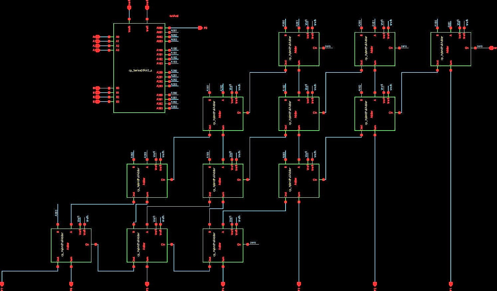

# High Performance 4 Bit Braun Multiplier with 22T Hybrid Full Adder
This Repository presents the design of a 4 Bit Braun Multiplier using 22T Hybrid Full Adder

# Table of Contents
[TOCM]

1. [Abstract](#Abstract)
2. [Reference Circuit Details](#reference-circuit-details)
3. [Installation of the tools](#installation-of-the-tools)
4. [Methodology](#Methodology)
    - [Step 1 Design AND Gate](#step-1-Design-and-gate)
    - [Step 2 Design 4X4 Matrix of AND Gates](#step-2-design-4x4-matrix-of-and-gates)
    - [Step 3 Design Full Adder](#step-3-design-full-adder)
    - [Step 4 Design 4-Bit Braun Multiplier](#step-4-design-4-bit-braun-multiplier) 
5. [Results](#results)
    - [Command Window](#command-window)
    - [Obtained Output Waveforms](#obtained-output-waveforms)
6. [References](#references)
7. [Acknowledgement](#Acknowledgement)
8. [Author](#author)

## Abstract

  ***Low power and high speed circuits have become important requirements in high performance VLSI design in the last few years. An Arithmetic Logic Unit basically consists of an Adder and a Multiplier. The basic component of any ALU is an adder and the operation performed by it is called as addition. And this adder is used as a building block to design a multiplier. Hence, multiplication becomes a fundamental unit of any DSP application like FFT, etc. As a result, new approaches to arithmetic circuit design are needed to achieve desirable output in terms of area, power and delay.***
  
  ***The main objective is to design a High Performance Adder and Multiplier which will be working upto 2 GHz clock frequency. The proposed Hybrid Full Adder is designed  using Pass Transistors, Transmission gates and Conventional Complementary Metal Oxide Semiconductor. For multiplication operation, Braun multiplier architecture has been implemented using the above mentioned adder. And the average propagation delay and power dissipated by both the circuits is also calculated.***

## Reference Circuit Details

### Braun Multiplier
  * The Braun multiplier has one ripple carry adder stage and '(n-1)' carry save adders for producing partial products. 
  * Carry Save Adder:
    - The carry save adder is a digital adder that is used to add three or more 'n' bit binary numbers together. It works in the same way as a Full adder.
  * Ripple Carry Adder:
    - The arithmetic sum of binary numbers is generated by a ripple carry adder, which is a digital circuit. It can be built using Full adders in a cascade, with              the carry outputs of each Full adder linked to the carry input of the next Full adder.
  * AND gates and Full adders make up the architecture of a Braun multiplier. Each partial product can be combined with the sum of partial products generated previously     by a row of adders.The carry out will be moved one bit to the left or right, and then it will be dded to the first adder's sum and the newly formed partial product.
  * The Carry Save Adder will be used to shift the data, and the Ripple Carry Adder will be used for the final stage of the output. As a result, the Braun multiplier         will be applied.

### 22T Hybrid Full Adder
  * The proposed FA is divided into four major modules:
    - two for carry generation 
    - two for sum genration.
  * Carry Generation:
    - A novel AND-OR module based on TG and CPL logic is implemented as part of the proposed carry generation part.  
                  
         
 
  * Sum Generation
    - The proposed FA's sum output is obtained by cascading two XOR modules.  
          
        
      

## Methodology

### Step 1 Design AND Gate
  

* The AND gate circuit is made of two modules 
  - NAND part
  - NOT part 
 
 
 
 
 
* The next step ater making the schematic of AND gate is to simulate it and generate its corresponding netlist.

### Step 2 Design 4x4 Matrix of AND Gates
  * For genrating partial products of the input bits we will use this module. 
 
 
 
 
 
* Note: Here each block in this matrix represens an AND symbol we have previously designed. 
  
 ```
 *  Generated for: PrimeSim
*  Design library name: cp_lib1
*  Design cell name: test_bench_4
*  Design view name: schematic
.lib 'saed32nm.lib' TT

*Custom Compiler Version S-2021.09
*Fri Feb 25 09:06:29 2022

.global gnd!
********************************************************************************
* Library          : cp_lib1
* Cell             : cp_and
* View             : schematic
* View Search List : hspice hspiceD schematic spice veriloga
* View Stop List   : hspice hspiceD
********************************************************************************
.subckt cp_and a b vrefh vrefl y
xm6 y net36 vrefl vrefl n105 w=0.1u l=0.03u nf=1 m=1
xm1 net5 b vrefl vrefl n105 w=0.2u l=0.03u nf=1 m=1
xm0 net36 a net5 vrefl n105 w=0.2u l=0.03u nf=1 m=1
xm7 y net36 vrefh vrefh p105 w=0.1u l=0.03u nf=1 m=1
xm3 net36 b vrefh vrefh p105 w=0.1u l=0.03u nf=1 m=1
xm2 net36 a vrefh vrefh p105 w=0.1u l=0.03u nf=1 m=1
.ends cp_and

********************************************************************************
* Library          : cp_lib1
* Cell             : cp_SeriesOfAND_s
* View             : schematic
* View Search List : hspice hspiceD schematic spice veriloga
* View Stop List   : hspice hspiceD
********************************************************************************
.subckt cp_seriesofand_s a0 a0b0 a0b1 a0b2 a0b3 a1 a1b0 a1b1 a1b2 a1b3 a2 a2b0
+ a2b1 a2b2 a2b3 a3 a3b0 a3b1 a3b2 a3b3 b0 b1 b2 b3 vrefh vrefl
xi15 a3 b3 vrefh vrefl a3b3 cp_and
xi14 a3 b2 vrefh vrefl a3b2 cp_and
xi13 a3 b1 vrefh vrefl a3b1 cp_and
xi12 a3 b0 vrefh vrefl a3b0 cp_and
xi11 a2 b3 vrefh vrefl a2b3 cp_and
xi10 a2 b2 vrefh vrefl a2b2 cp_and
xi9 a2 b1 vrefh vrefl a2b1 cp_and
xi8 a2 b0 vrefh vrefl a2b0 cp_and
xi7 a1 b3 vrefh vrefl a1b3 cp_and
xi6 a1 b2 vrefh vrefl a1b2 cp_and
xi5 a1 b1 vrefh vrefl a1b1 cp_and
xi4 a1 b0 vrefh vrefl a1b0 cp_and
xi3 a0 b3 vrefh vrefl a0b3 cp_and
xi2 a0 b2 vrefh vrefl a0b2 cp_and
xi1 a0 b1 vrefh vrefl a0b1 cp_and
xi0 a0 b0 vrefh vrefl a0b0 cp_and
.ends cp_seriesofand_s

********************************************************************************
* Library          : cp_lib1
* Cell             : test_bench_4
* View             : schematic
* View Search List : hspice hspiceD schematic spice veriloga
* View Stop List   : hspice hspiceD
********************************************************************************
xi0 net29 1 2 3 4 gnd! 5 6 7 8 gnd! 9 10 11 12 net27 13 14 15 16 net33 net35
+ net31 gnd! net38 gnd! cp_seriesofand_s
v9 net38 gnd! dc=1.070
v5 net35 gnd! dc=1.07
v4 net33 gnd! dc=1.07
v3 net31 gnd! dc=1.07
v2 net29 gnd! dc=1.07
v1 net27 gnd! dc=1.07

.tran '1n' '40n' name=tran

.option primesim_remove_probe_prefix = 0
.probe v(*) i(*) level=1
.probe tran v(1) v(10) v(11) v(12) v(13) v(14) v(15) v(16) v(2) v(3) v(4) v(5)
+ v(6) v(7) v(8) v(9)

.temp 25

.option primesim_output=wdf

.option parhier = LOCAL

.end
 ``` 
 
* Netlist generated after its testbench was created is shown above

### Step 3 Design Full Adder 
 
 
 
 
 
```
*  Generated for: PrimeSim
*  Design library name: cp_lib1
*  Design cell name: testBench_2
*  Design view name: schematic
.lib 'saed32nm.lib' TT

*Custom Compiler Version S-2021.09
*Fri Feb 25 09:02:35 2022

.global gnd!
********************************************************************************
* Library          : cp_lib1
* Cell             : cp_HybridFullAdder
* View             : schematic
* View Search List : hspice hspiceD schematic spice veriloga
* View Stop List   : hspice hspiceD
********************************************************************************
.subckt cp_hybridfulladder a b cin cout sum vrefh vrefl
xm20 cin_bar cin vrefl vrefl n105 w=0.1u l=0.03u nf=1 m=1
xm19 a_bar a vrefl vrefl n105 w=0.1u l=0.03u nf=1 m=1
xm16 vrefl a_bar net61 vrefl n105 w=0.1u l=0.03u nf=1 m=1
xm14 sum a_xor_b cin_bar vrefl n105 w=0.1u l=0.03u nf=1 m=1
xm12 a_xor_b b a_bar vrel n105 w=0.1u l=0.03u nf=1 m=1
xm10 a_xor_b cin_bar sum vrefl n105 w=0.1u l=0.03u nf=1 m=1
xm8 b a_bar a_xor_b vrel n105 w=0.1u l=0.03u nf=1 m=1
xm6 net26 cin cout vrel n105 w=0.1u l=0.03u nf=1 m=1
xm4 b a_bar net26 vrel n105 w=0.1u l=0.03u nf=1 m=1
xm2 net61 cin_bar cout vrel n105 w=0.1u l=0.03u nf=1 m=1
xm0 b a net61 vrefl n105 w=0.1u l=0.03u nf=1 m=1
xm21 cin_bar cin vrefh vrefh p105 w=0.1u l=0.03u nf=1 m=1
xm18 a_bar a vrefh vrefh p105 w=0.1u l=0.03u nf=1 m=1
xm17 net26 a_bar vrefh vrefh p105 w=0.1u l=0.03u nf=1 m=1
xm15 cin a_xor_b sum vrefh p105 w=0.1u l=0.03u nf=1 m=1
xm13 a b a_xor_b vrefh p105 w=0.1u l=0.03u nf=1 m=1
xm11 sum cin a_xor_b vrefh p105 w=0.1u l=0.03u nf=1 m=1
xm9 a_xor_b a b vrefh p105 w=0.1u l=0.03u nf=1 m=1
xm7 cout cin_bar net26 vrefh p105 w=0.1u l=0.03u nf=1 m=1
xm5 net26 a b vrefh p105 w=0.1u l=0.03u nf=1 m=1
xm3 cout cin net61 vrefh p105 w=0.1u l=0.03u nf=1 m=1
xm1 net61 a_bar b vrefh p105 w=0.1u l=0.03u nf=1 m=1
.ends cp_hybridfulladder

********************************************************************************
* Library          : cp_lib1
* Cell             : testBench_2
* View             : schematic
* View Search List : hspice hspiceD schematic spice veriloga
* View Stop List   : hspice hspiceD
********************************************************************************
xi0 a b net11 cout sum net8 gnd! cp_hybridfulladder
v1 net8 gnd! dc=1.05
v4 b gnd! dc=0 pulse ( 1.05 0 0 10p 10p 400n 800n )
v3 a gnd! dc=0 pulse ( 1.05 0 0 10p 10p 200n 400n )
v2 net11 gnd! dc=0 pulse ( 1.05 0 0 10p 10p 100n 200n )

.tran '1n' '40n' name=tran

.option primesim_remove_probe_prefix = 0
.probe v(*) i(*) level=1
.probe tran v(a) v(b) v(cout) v(sum) v(net11)

.temp 25

.option primesim_output=wdf

.option parhier = LOCAL

.end
``` 
 
* The netlist generated after creating the testbench for Hybrid Full Adder is shown above. 
 
### Step 4 Design 4-Bit Braun Multiplier 
 
 
 
 
 
*  
``` 
*  Generated for: PrimeSim
*  Design library name: cp_lib1
*  Design cell name: test_bench_3
*  Design view name: schematic
.lib 'saed32nm.lib' TT

*Custom Compiler Version S-2021.09
*Fri Feb 25 08:32:03 2022

.global gnd!
********************************************************************************
* Library          : cp_lib1
* Cell             : cp_HybridFullAdder
* View             : schematic
* View Search List : hspice hspiceD schematic spice veriloga
* View Stop List   : hspice hspiceD
********************************************************************************
.subckt cp_hybridfulladder a b cin cout sum vrefh vrefl
xm20 cin_bar cin vrefl vrefl n105 w=0.1u l=0.03u nf=1 m=1
xm19 a_bar a vrefl vrefl n105 w=0.1u l=0.03u nf=1 m=1
xm16 vrefl a_bar net61 vrefl n105 w=0.1u l=0.03u nf=1 m=1
xm14 sum a_xor_b cin_bar vrefl n105 w=0.1u l=0.03u nf=1 m=1
xm12 a_xor_b b a_bar vrel n105 w=0.1u l=0.03u nf=1 m=1
xm10 a_xor_b cin_bar sum vrefl n105 w=0.1u l=0.03u nf=1 m=1
xm8 b a_bar a_xor_b vrel n105 w=0.1u l=0.03u nf=1 m=1
xm6 net26 cin cout vrel n105 w=0.1u l=0.03u nf=1 m=1
xm4 b a_bar net26 vrel n105 w=0.1u l=0.03u nf=1 m=1
xm2 net61 cin_bar cout vrel n105 w=0.1u l=0.03u nf=1 m=1
xm0 b a net61 vrefl n105 w=0.1u l=0.03u nf=1 m=1
xm21 cin_bar cin vrefh vrefh p105 w=0.1u l=0.03u nf=1 m=1
xm18 a_bar a vrefh vrefh p105 w=0.1u l=0.03u nf=1 m=1
xm17 net26 a_bar vrefh vrefh p105 w=0.1u l=0.03u nf=1 m=1
xm15 cin a_xor_b sum vrefh p105 w=0.1u l=0.03u nf=1 m=1
xm13 a b a_xor_b vrefh p105 w=0.1u l=0.03u nf=1 m=1
xm11 sum cin a_xor_b vrefh p105 w=0.1u l=0.03u nf=1 m=1
xm9 a_xor_b a b vrefh p105 w=0.1u l=0.03u nf=1 m=1
xm7 cout cin_bar net26 vrefh p105 w=0.1u l=0.03u nf=1 m=1
xm5 net26 a b vrefh p105 w=0.1u l=0.03u nf=1 m=1
xm3 cout cin net61 vrefh p105 w=0.1u l=0.03u nf=1 m=1
xm1 net61 a_bar b vrefh p105 w=0.1u l=0.03u nf=1 m=1
.ends cp_hybridfulladder

********************************************************************************
* Library          : cp_lib1
* Cell             : cp_and
* View             : schematic
* View Search List : hspice hspiceD schematic spice veriloga
* View Stop List   : hspice hspiceD
********************************************************************************
.subckt cp_and a b vrefh vrefl y
xm6 y net36 vrefl vrefl n105 w=0.1u l=0.03u nf=1 m=1
xm1 net5 b vrefl vrefl n105 w=0.2u l=0.03u nf=1 m=1
xm0 net36 a net5 vrefl n105 w=0.2u l=0.03u nf=1 m=1
xm7 y net36 vrefh vrefh p105 w=0.1u l=0.03u nf=1 m=1
xm3 net36 b vrefh vrefh p105 w=0.1u l=0.03u nf=1 m=1
xm2 net36 a vrefh vrefh p105 w=0.1u l=0.03u nf=1 m=1
.ends cp_and

********************************************************************************
* Library          : cp_lib1
* Cell             : cp_SeriesOfAND_s
* View             : schematic
* View Search List : hspice hspiceD schematic spice veriloga
* View Stop List   : hspice hspiceD
********************************************************************************
.subckt cp_seriesofand_s a0 a0b0 a0b1 a0b2 a0b3 a1 a1b0 a1b1 a1b2 a1b3 a2 a2b0
+ a2b1 a2b2 a2b3 a3 a3b0 a3b1 a3b2 a3b3 b0 b1 b2 b3 vrefh vrefl
xi15 a3 b3 vrefh vrefl a3b3 cp_and
xi14 a3 b2 vrefh vrefl a3b2 cp_and
xi13 a3 b1 vrefh vrefl a3b1 cp_and
xi12 a3 b0 vrefh vrefl a3b0 cp_and
xi11 a2 b3 vrefh vrefl a2b3 cp_and
xi10 a2 b2 vrefh vrefl a2b2 cp_and
xi9 a2 b1 vrefh vrefl a2b1 cp_and
xi8 a2 b0 vrefh vrefl a2b0 cp_and
xi7 a1 b3 vrefh vrefl a1b3 cp_and
xi6 a1 b2 vrefh vrefl a1b2 cp_and
xi5 a1 b1 vrefh vrefl a1b1 cp_and
xi4 a1 b0 vrefh vrefl a1b0 cp_and
xi3 a0 b3 vrefh vrefl a0b3 cp_and
xi2 a0 b2 vrefh vrefl a0b2 cp_and
xi1 a0 b1 vrefh vrefl a0b1 cp_and
xi0 a0 b0 vrefh vrefl a0b0 cp_and
.ends cp_seriesofand_s

********************************************************************************
* Library          : cp_lib1
* Cell             : cp_BraunMultiplier
* View             : schematic
* View Search List : hspice hspiceD schematic spice veriloga
* View Stop List   : hspice hspiceD
********************************************************************************
.subckt cp_braunmultiplier a0 a1 a2 a3 b0 b1 b2 b3 p0 p1 p2 p3 p4 p5 p6 p7 vrefh
+  vrefl zero
xi11 net37 net44 zero net58 p4 vrefh vrefl cp_hybridfulladder
xi10 net43 net52 net58 net59 p5 vrefh vrefl cp_hybridfulladder
xi9 net51 a3b3 net59 p7 p6 vrefh vrefl cp_hybridfulladder
xi8 net34 a0b3 net33 net37 p3 vrefh vrefl cp_hybridfulladder
xi7 net39 a1b3 net38 net43 net44 vrefh vrefl cp_hybridfulladder
xi6 a2b3 a3b2 net46 net51 net52 vrefh vrefl cp_hybridfulladder
xi5 net19 a0b2 net18 net33 p2 vrefh vrefl cp_hybridfulladder
xi4 net24 a1b2 net23 net38 net34 vrefh vrefl cp_hybridfulladder
xi3 a2b2 a3b1 net28 net46 net39 vrefh vrefl cp_hybridfulladder
xi2 a2b1 a3b0 zero net28 net24 vrefh vrefl cp_hybridfulladder
xi1 a1b1 a2b0 zero net23 net19 vrefh vrefl cp_hybridfulladder
xi0 a0b1 a1b0 zero net18 p1 vrefh vrefl cp_hybridfulladder
xi12 a0 p0 a0b1 a0b2 a0b3 a1 a1b0 a1b1 a1b2 a1b3 a2 a2b0 a2b1 a2b2 a2b3 a3 a3b0
+ a3b1 a3b2 a3b3 b0 b1 b2 b3 vrefh vrefl cp_seriesofand_s
.ends cp_braunmultiplier

********************************************************************************
* Library          : cp_lib1
* Cell             : test_bench_3
* View             : schematic
* View Search List : hspice hspiceD schematic spice veriloga
* View Stop List   : hspice hspiceD
********************************************************************************
xi0 a0 a1 a2 a3 b0 b1 b2 b3 p0 p1 p2 p3 p4 p5 p6 p7 net31 gnd! gnd!
+ cp_braunmultiplier
v16 b0 gnd! dc=0
v15 b2 gnd! dc=0
v14 a2 gnd! dc=0
v6 net31 gnd! dc=1.05
v11 a3 gnd! dc=0 pulse ( 1.07 0 0 010p 10p 40n 80n )
v12 b1 gnd! dc=0 pulse ( 1.07 0 0 010p 10p 30n 60n )
v13 b3 gnd! dc=0 pulse ( 1.07 0 0 010p 10p 50n 100n )
v9 a0 gnd! dc=0 pulse ( 1.07 0 0 10p 10p 10n 20n )
v10 a1 gnd! dc=0 pulse ( 1.07 0 0 10p 10p 20n 40n )

.tran '1n' '40n' name=tran

.option primesim_remove_probe_prefix = 0
.probe v(*) i(*) level=1
.probe tran v(p0) v(p1) v(p2) v(p3) v(p4) v(p5) v(p6) v(p7)

.temp 25

.option primesim_output=wdf

.option parhier = LOCAL

.end
```

